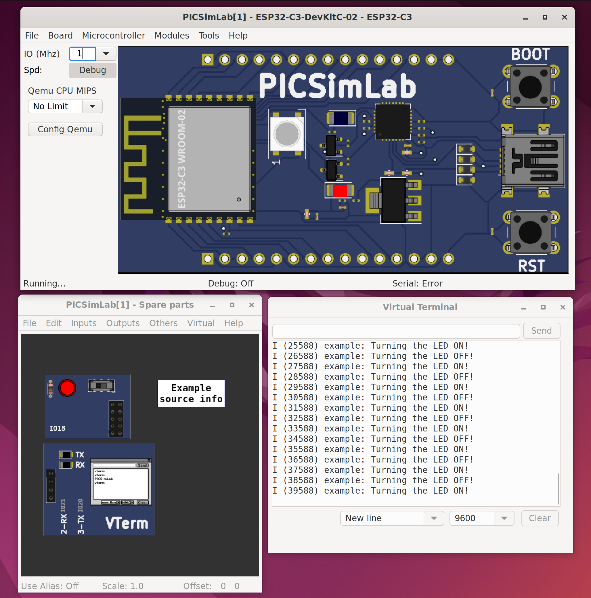

# picsimlab-vm
PICsimLab virtual machine

### Requirements

- [VirtualBox](https://www.virtualbox.org)
- [Vagrant](https://www.vagrantup.com/)
  - reload plugin (automatically installed)
  - vbguest plugin (automatically installed)

### Using

#### Clone this repo

```
git clone https://github.com/geyslan/picsimlab-vm.git
```

#### Get the VM up

In the repo folder, start provisioning the VM using Vagrant.

```
cd picsimlab-vm
vagrant up
```

#### Log in (GUI) and run PICSimLab

After the VM be provisioned, log in through its GUI.

```
user: vagrant
password: vagrant
```

Run **PICSimLab** and choose a board.



#### Test connection

In the host machine connect to PICSimLab.

```
nc localhost 5000
```

```
PICSimLab Remote Control Interface

  Type help to see supported commands

>help
List of supported commands:
  clk [val MHz]- show or set simulation clock
  dumpe [a] [s]- dump internal EEPROM memory
  dumpf [a] [s]- dump Flash memory
  dumpr [a] [s]- dump RAM memory
  exit         - shutdown PICSimLab
  get ob       - get object value
  help         - show this message
  info         - show actual setup info and objects
  loadhex file - load hex file (use full path)
  pins         - show pins directions and values
  pinsl        - show pins formated info
  quit         - exit remote control interface
  reset        - reset the board
  set ob vl    - set object with value
  sim [cmd]    - show simulation status or execute cmd start/stop
  sync         - wait to syncronize with timer event
  version      - show PICSimLab version
Ok
>info
Board:     ESP32-C3-DevKitC-02
Processor: ESP32-C3
Frequency:    1000000 Hz
Use Spare: 1
    board.out[03] LD_USER=   0
  part[00]: LEDs
  part[01]: IO Virtual Term
    part[01].in[00] PB_TERM= 1
    part[01].in[01] VT_VTERM=   0
    part[01].out[05] VT_VTERM=   0
  part[02]: Text Box
Ok
```
